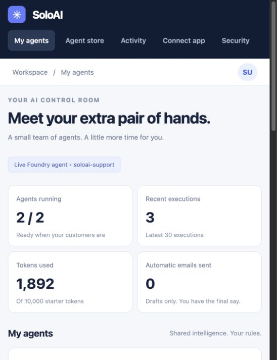
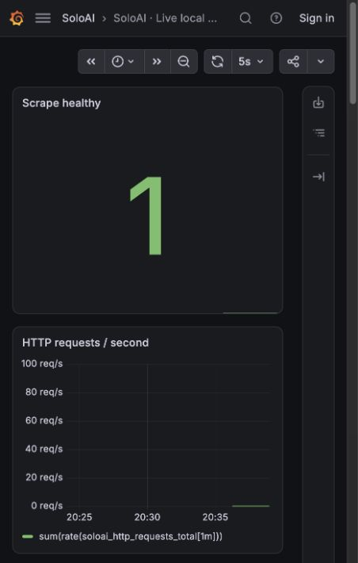
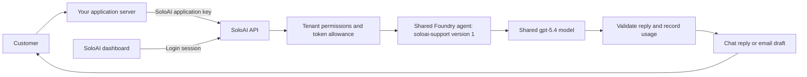
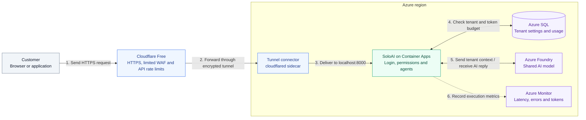

> **SoloAI is the plug-and-play AI control plane for founders who can build software with AI but don't want to become AI infrastructure engineers.**

# SoloAI

An Azure-oriented SaaS MVP for connecting an existing application to a small, permission-limited AI team. Your application stays on AWS, Vercel or your own infrastructure. SoloAI hosts the control plane and routes requests to a shared Azure Foundry model using each customer's configuration.

**Connect app → Choose agent → Add business guidance → Review permissions → Turn on.**

## Run without cloud charges

Use the [free local architecture](docs/FREE-LOCAL.md): local Python, SQLite, Prometheus
and Grafana, with simulated AI replies. Start with `bash scripts/run-free-local.sh`
after activating your Python environment. Live Foundry and the Azure Terraform stack
remain optional paid modes; this does not claim free public hosting.

## Demo screenshots

Real screenshots of the running local application using synthetic Acme Studio data. The demo explicitly labels its replies as simulated; these are not evidence of a deployed Azure service.

| Dashboard | Email agent |
|---|---|
|  |  |

[Login screenshot](docs/screenshots/login.png)

### Current platform and Grafana :  actual local monitoring

| Platform | Grafana |
|---|---|
|  |  |

Captured from the running local stack, not an Azure deployment. The green scrape
status is real; low traffic can leave rate charts nearly flat. This screenshot was
taken in the live Foundry profile; its AI requests are billable.

## What works

- Account registration/login, logout and one isolated workspace per owner.
- Website Chat replies and Email Support drafts through an authenticated event API.
- Per-tenant agent configuration, guidance, enable/disable and emergency stop without customer redeployment.
- Shared Azure OpenAI/Foundry chat endpoint with managed identity. No model keys in the browser.
- Fixed least-privilege capabilities: respond or draft; no email send/delete or customer database access.
- 10,000 lifetime starter tokens and 20 agent requests per minute per workspace, enforced in SQL before inference.
- Execution status, latency, token totals, optional operator-configured cost estimate and configuration audit history.
- Server-side JavaScript SDK, application key generation/rotation and connection instructions.
- Minimal Terraform: Cloudflare Free + Tunnel, private Container Apps/data/model connections, managed identity, basic monitoring and Azure OIDC CI and a scoped Cloudflare API token.

**Current scope:** a working local MVP and Azure deployment foundation. Azure inference is implemented but requires your configured model and credentials. There is no live Gmail/Outlook connection, email sending, billing, third-party marketplace execution, or production identity lifecycle. Planned store cards are labeled accordingly. See [security limitations](SECURITY.md) and [Azure launch steps](docs/AZURE.md).

## Run locally

Python 3.13 is recommended. From the repository root:

```bash
python3 -m venv .venv
source .venv/bin/activate
pip install -r requirements.txt
uvicorn app.main:app --host 127.0.0.1 --port 8000 --no-access-log
```

Open **http://127.0.0.1:8000**. Create a workspace with a password of at least 12 characters. Agents start disabled. Open an agent, add business guidance, save, turn it on, then try a message. Test Email Support the same way; it returns a draft.

Without either `AZURE_OPENAI_ENDPOINT` or `AZURE_FOUNDRY_PROJECT_ENDPOINT`, the application uses clearly labeled deterministic demo replies. No API key, model subscription or AI charge is required. The local SQLite file is ignored by Git. The repository does not ship accounts or passwords. `.env.example` documents settings; the app reads environment variables and does not automatically load `.env`.

## Connect an existing app

Create a key in **Connect app**. Copy `sdk/soloai.mjs` into your server project. Authenticate your own end users and add per-user limits before forwarding events.

```javascript
import { SoloAI } from './sdk/soloai.mjs';
const solo = new SoloAI({
  baseUrl: process.env.SOLOAI_URL,
  apiKey: process.env.SOLOAI_API_KEY
});
const result = await solo.emit('chat.message', {
  content: 'Can I return my order?'
});
// Return result.reply to the authenticated customer.
```

For email, emit `email.received` with the incoming message as `content`. The response has `draft: true`; show it to a human for review. Your integration is responsible for receiving email. SoloAI does not claim to poll an inbox or create a provider-side draft.

Never place the SoloAI key in frontend code. Key rotation invalidates the old key immediately. Request payloads cannot supply or override a tenant ID. Events are synchronous, have no automatic retries, and do not have exactly-once semantics.

## Prepared Foundry support agent

[**SoloAI Support agent**](agents/soloai-support/README.md) includes website replies, review-only email drafts, a tool-free definition, synthetic test cases and a creation script. Agent `soloai-support:1` has been created in the configured Foundry project and passed a live synthetic email-draft check using `gpt-5.4`. Both dashboard test flows now invoke the pinned agent through the optional Foundry adapter. See [live setup](docs/live-agent.md).

## Foundry agent integration: identity or API key

### Recommended: connect the SoloAI runtime with Microsoft Entra ID

After installing the Python requirements, authenticate locally with `az login` and
export these settings before starting SoloAI:

```bash
export AZURE_FOUNDRY_PROJECT_ENDPOINT=https://soloai-v0-resource.services.ai.azure.com/api/projects/soloai-v0
export AZURE_FOUNDRY_AGENT_NAME=soloai-support
export AZURE_FOUNDRY_AGENT_VERSION=1
export AZURE_FOUNDRY_MODEL=gpt-5.4
uvicorn app.main:app --host 127.0.0.1 --port 8000 --no-access-log --no-proxy-headers
```

In Azure, use the application's managed identity with the required project read/invoke
permissions. These settings take precedence over the direct-model backend. The adapter
checks the pinned agent definition and validates its JSON reply. See [full setup](docs/live-agent.md).

### Optional: Foundry project REST API with an API key

Microsoft's [Foundry REST reference](https://ai.azure.com/api-reference) documents
`api-key` authentication for project APIs. Use this option only where the target
resource and operation accept keys and local authentication is enabled.
**This is a standalone REST integration example, not a supported authentication
switch in the current SoloAI runtime**, which uses `DefaultAzureCredential`.
Setting `FOUNDRY_API_KEY` does not change the dashboard's authentication method.
This key path has not been live-tested against the configured SoloAI project.

Store the key in a server-side secret manager and inject `FOUNDRY_API_KEY` into the
process environment. Do not paste it into source code, frontend code, or shell history.
With `AZURE_FOUNDRY_PROJECT_ENDPOINT` set as above, this Python example calls the
pinned support agent:

```python
import os
import httpx

response = httpx.post(
    os.environ['AZURE_FOUNDRY_PROJECT_ENDPOINT'].rstrip('/') + '/openai/v1/responses',
    headers={'api-key': os.environ['FOUNDRY_API_KEY']},
    json={
        'agent_reference': {
            'type': 'agent_reference', 'name': 'soloai-support', 'version': '1'
        },
        'input': '{"channel":"website_chat","business_guidance":"We offer a 30-day return policy.","customer_message":"What is your return policy?"}',
        'store': False,
        'max_output_tokens': 2048,
    },
    timeout=60,
)
response.raise_for_status()
# Parse and validate response.json() on your server; avoid logging customer content.
```

This direct example bypasses SoloAI's tenant permissions and usage accounting; use
SoloAI's `/api/events` endpoint for customer-facing integrations. A SoloAI application
key (`SOLOAI_API_KEY`) authenticates your server to SoloAI and is different from an
Azure resource key. If Azure returns 401/403, verify endpoint support, key scope and
local-auth policy; keep Entra authentication where keys are unavailable. The existing
Terraform deliberately requires local authentication to be disabled on its shared
model resource; these instructions do not change that policy.

### Simple request flow



The SoloAI-to-Foundry connection currently uses Entra ID. Each invocation contains
only the authenticated workspace's guidance and message, with no shared conversation.
For the planned Azure deployment, Cloudflare Free WAF protects the SoloAI API and routes
to Container Apps privately; that infrastructure is not part of the local demo.

## Use Azure Foundry directly as a model

Use a chat-compatible Azure OpenAI deployment in Foundry. Set:

```bash
export AZURE_OPENAI_ENDPOINT=https://YOUR-RESOURCE.openai.azure.com
export AZURE_OPENAI_DEPLOYMENT=YOUR-DEPLOYMENT-NAME
```

For local Azure access, sign in with Azure CLI and grant the principal the **Cognitive Services OpenAI User** role on that resource. Azure deployment uses the app's managed identity. The same model serves every customer with separate tenant context. The chosen deployment must support the OpenAI v1 chat-completions API and its output-token parameter.

`SOLOAI_ENV=production` rejects SQLite and missing model configuration; cookies become Secure. Azure SQL and the exact `PUBLIC_ORIGIN` are required. Follow [Azure deployment](docs/AZURE.md), including reduction of bootstrap database privileges, before using real customer data. Model pricing, quota and resource costs are not bundled or assumed.

## Database costs and availability

Terraform now creates Azure SQL Database with the free allowance enabled and
`AutoPause` when that allowance runs out. The allowance renews monthly. When the
database is paused at the limit, login, agent settings and agent execution cannot
work until it becomes available again. See [database setup](docs/AZURE-SQL.md).

> **Note:** Cloudflare Free replaces the paid Azure edge. Container Apps, private endpoints,
> Key Vault, monitoring and Foundry tokens can still incur charges. The tunnel needs
> at least one running app replica. See [Cloudflare setup](docs/CLOUDFLARE.md).

## Terraform and architecture guide

**[Terraform IaC →](infra/terraform/README.md)** :  one root configuration, split into networking, database, identity, secrets, application and monitoring files, with comments, input validation, remote-state examples and mocked security tests.

**[Architecture diagrams →](docs/ARCHITECTURE.md)** :  Azure services and network boundaries, concurrent customer signup/agent activation, shared-model tenant isolation, event routing, failure behavior, reliability and scaling decisions.

Terraform is the supported private-edge deployment. Cloudflare Free + Tunnel is the public entry point; Container Apps, database, vault and model access are private. GitHub Actions supports opt-in reviewed-plan deployment; see the deployment runbook. The old Bicep files are legacy references.

## Architecture

For an optional Azure-only design, see [Traffic Manager + Application Gateway WAF](docs/ARCHITECTURE.md#azure-native-alternative-traffic-manager-and-application-gateway). This is a documented alternative, not deployed infrastructure.



**Read the numbered steps from 1 to 6.** Cloudflare checks the request before
forwarding it. The connector establishes the tunnel **outbound from Azure**;
step 2 shows the request travelling through that existing connection. The connector
and SoloAI run in the same replica, and the app has no public ingress.

The reply follows the same route back: **SoloAI → Tunnel connector → Cloudflare → Customer**.
SQL and Foundry use private connections. SoloAI records actual token usage in SQL
after the model call and sends operational metadata to Azure Monitor. Key Vault,
managed identity and private DNS support the design but are omitted for readability.


One service plus Azure SQL keeps the MVP small. Agent activation changes database configuration, not infrastructure. Azure SQL coordinates limits across replicas. There are no per-customer containers, per-customer models, Kubernetes clusters or speculative workflow builders. [Architecture, tradeoffs and scaling path](docs/ARCHITECTURE.md).

## Tests and verification

```bash
pip install -r requirements-dev.txt
pytest -q
pip-audit -r requirements.txt
terraform -chdir=infra/terraform init -backend=false
terraform -chdir=infra/terraform validate
terraform -chdir=infra/terraform test
docker build -t soloai:local .
```

Tests cover tenant isolation, wrong-key rejection, key rotation, disabled agents, unsupported send operations, draft semantics, quota admission, concurrent budget requests, origin checks, logout, input bounds and production configuration guards. Screenshot verification exercised login and the email draft flow with synthetic data. Azure resource provisioning and a real model call have not been performed locally. See [validation record](docs/VALIDATION.md).

## Repository map

```text
app/main.py              API, auth, persistence, orchestrator
app/packages.py          Trusted first-party package registry
app/static/              Responsive dashboard (no frontend build required)
sdk/soloai.mjs           Server-only JavaScript integration
examples/server.mjs     Chat and email event examples
infra/main.bicep         Legacy Bicep reference
infra/terraform/         Minimal private-edge Terraform + runbook + tests
azure-pipelines.yml     Application + Terraform validation
.github/workflows/      GitHub validation
scripts/                Deployment parameters and metadata cleanup
tests/                 Security and behavior checks
docs/                  Architecture, deployment and actual screenshots
```

## Next release

Verified identity and recovery → least-privilege runtime role and RLS → Gmail/Outlook OAuth with draft-only scopes → controlled customer APIs → durable jobs and reconciliation → marketplace package validation. Add these in response to real usage, without changing the founder's simple install-and-enable experience.

### Operations monitoring

[Monitoring guide](docs/monitoring.md): Azure Monitor Workbook for throughput,
P95/P99 latency, execution error budget, total token utilization and infrastructure
metrics, with three bounded alerts. Reuses Log Analytics; no Prometheus/Grafana server.

### Terraform CI/CD

[Pipeline setup](docs/CICD.md): reviewed PR plan → merge → fresh saved plan → protected
environment approval → Azure apply → health check. Uses OIDC and a private runner.
Enable `TERRAFORM_DELIVERY_ENABLED` only after configuring identities, state and approvals.

### Try a local Grafana dashboard

[Local monitoring instructions](monitoring/README.md) run optional Prometheus and
Grafana alongside the live platform, without deploying Azure hosting infrastructure.
