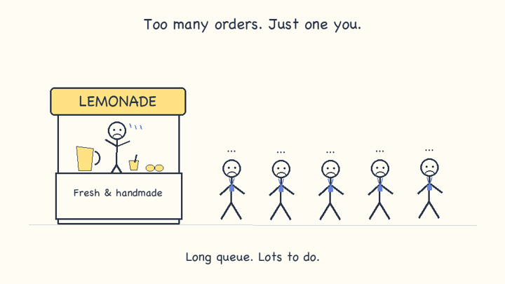

> **SoloAI is the plug-and-play AI control plane for founders who can build software with AI but don't want to become AI infrastructure engineers.**

# SoloAI

## One platform. Many agents.

SoloAI gives founders a place to connect their tools and put agents to work. The goal is fewer repetitive tasks, clear permissions and guardrails you can understand without learning how AI infrastructure works.

Your application stays where it is, whether that is Vercel, AWS or another host. SoloAI connects to the services an agent needs. You choose what it can access and review the results.

**Create an account → Connect a tool → Set your agent's guidance → Turn it on.**

We are starting with customer support. Website Chat answers questions using your guidance. Email Support prepares replies for review. More agents and simpler connections are the direction of the product, not a promise that every integration is ready today.

## Try it on your computer

Install Python 3.13 and Git, then run:

```bash
git clone https://github.com/sumitsharma01/soloai.git
cd soloai
bash scripts/run-free-local.sh
```

Already have the repository? Run the last command from its folder. The script creates a Python environment and installs dependencies on first use. An internet connection is needed to download them.

Open [SoloAI](http://127.0.0.1:8000), choose **Create a workspace**, and use your own email and password. This creates a local account, not a Gmail connection. Open **My agents**, add some business guidance, enable an agent and try a message.

This preview uses simulated replies and a local SQLite database. It does not deploy Azure, call a paid model, connect Gmail or start Grafana. Stop it with `Ctrl+C`. Your workspace stays on your computer for the next run.

If port 8000 is already in use:

```bash
SOLOAI_LOCAL_PORT=8001 bash scripts/run-free-local.sh
```

Then open [port 8001](http://127.0.0.1:8001). For more help, see [Getting started](docs/GETTING-STARTED.md).

## Connect your tools

Open **Integrations** in SoloAI. It is the starting point for connections and their status.

| Connection | Available today |
|---|---|
| Gmail | Sign in with Google once your SoloAI operator has configured Gmail. Read new inbox messages and prepare drafts. No sending or deleting. |
| Booking information | Read-only lookup through an approved MCP connection configured by your operator, or a local support snapshot. |
| Your application | Optional server API for custom events. Kept under the developer section. |
| Supabase | [Guided setup form](docs/SUPABASE.md) for booking data. Saves a workspace request; authorization and database access are pending operator implementation. |
| Outlook and other services | Planned. |

You do not need to give SoloAI access to your AWS or Vercel account just because your website runs there. Connect the mailbox or approved business data the agent needs instead.

For a managed SoloAI service, the operator sets up the Google application once and customers use **Connect with Google**. If you run SoloAI yourself, you are also its operator and must complete that setup. The local preview does not skip Google's requirements.

## Keep control

- Each workspace has its own agent settings, permissions and usage allowance.
- Booking access is read-only. Agents do not get unrestricted database credentials.
- Emails remain drafts. Approving a draft records your decision; it does not send it.
- Stop controls and token limits bound agent activity.
- Manual test content is transient. The optional email review workflow stores emails and drafts temporarily, with a configurable retention period.

These controls reduce risk; they do not guarantee that an AI response is correct. See [security boundaries and limitations](SECURITY.md).

## Go beyond the preview

These guides are for the person running SoloAI. Customers of a configured instance should not need to follow infrastructure instructions.

| Task | Guide |
|---|---|
| Use the product locally | [Getting started](docs/GETTING-STARTED.md) |
| Connect a real model | [Foundry setup](docs/IMPLEMENTATION.md#prepared-foundry-support-agent) |
| Receive Gmail and review drafts | [Gmail setup](docs/GMAIL.md) and [email worker](docs/EMAIL-WORKFLOWS.md) |
| Connect booking data | [MCP setup](docs/MCP.md) |
| Run Grafana and Prometheus | [Monitoring](docs/monitoring.md) |
| Understand Azure and Cloudflare | [Architecture](docs/ARCHITECTURE.md) |
| Deploy with Terraform and GitHub Actions | [CI/CD](docs/CICD.md) |
| Diagnose a known issue | [Runbooks](docs/runbooks/README.md) |
| Develop or operate SoloAI | [Implementation reference](docs/IMPLEMENTATION.md) |

## Product demo

[](docs/media/soloai-lemonade.mp4)

The animation illustrates the product vision. The screenshots below show earlier local demo sessions; they are not evidence of an Azure deployment. The navigation has since been consolidated into Integrations.

| SoloAI | Grafana |
|---|---|
|  |  |
