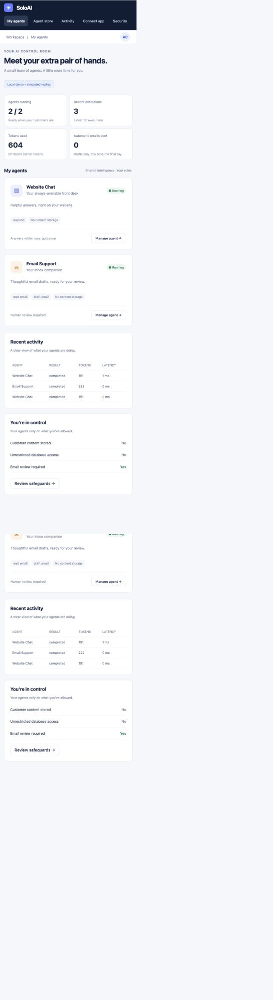
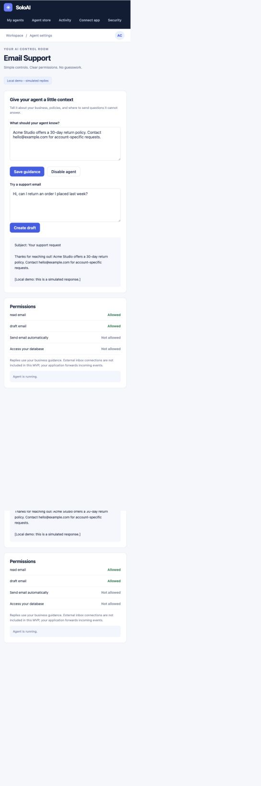
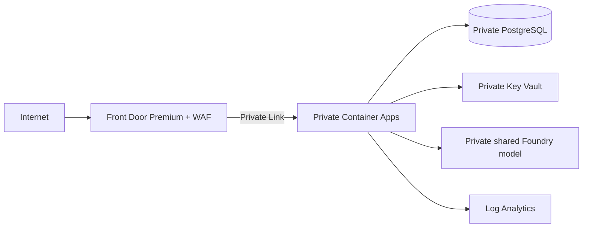

> **SoloAI is the plug-and-play AI control plane for founders who can build software with AI but don't want to become AI infrastructure engineers.**

# SoloAI

An Azure-oriented SaaS MVP for connecting an existing application to a small, permission-limited AI team. Your application stays on AWS, Vercel or your own infrastructure. SoloAI hosts the control plane and routes requests to a shared Azure Foundry model using each customer's configuration.

**Connect app → Choose agent → Add business guidance → Review permissions → Turn on.**

## Demo screenshots

Real screenshots of the running local application using synthetic Acme Studio data. The demo explicitly labels its replies as simulated; these are not evidence of a deployed Azure service.

| Dashboard | Email agent |
|---|---|
|  |  |

[Login screenshot](docs/screenshots/login.png)

## What works

- Account registration/login, logout and one isolated workspace per owner.
- Website Chat replies and Email Support drafts through an authenticated event API.
- Per-tenant agent configuration, guidance, enable/disable and emergency stop without customer redeployment.
- Shared Azure OpenAI/Foundry chat endpoint with managed identity. No model keys in the browser.
- Fixed least-privilege capabilities: respond or draft; no email send/delete or customer database access.
- 10,000 lifetime starter tokens and 20 agent requests per minute per workspace, enforced in SQL before inference.
- Execution status, latency, token totals, optional operator-configured cost estimate and configuration audit history.
- Server-side JavaScript SDK, application key generation/rotation and connection instructions.
- Minimal Terraform: Front Door Premium + WAF, private Container Apps/data/model connections, managed identity, basic monitoring and credential-free CI.

**Current scope:** a working local MVP and Azure deployment foundation. Azure inference is implemented but requires your configured model and credentials. There is no live Gmail/Outlook connection, email sending, billing, third-party marketplace execution, or production identity lifecycle. Planned store cards are labeled accordingly. See [security limitations](SECURITY.md) and [Azure launch steps](docs/AZURE.md).

## Run locally

Python 3.13 is recommended. From the repository root:

```bash
python3 -m venv .venv
source .venv/bin/activate
pip install -r requirements.txt
uvicorn app.main:app --host 127.0.0.1 --port 8000 --no-access-log
```

Open **http://127.0.0.1:8000**. Create a workspace with a password of at least 12 characters. Agents start disabled. Open an agent, add business guidance, save, turn it on, then try a message. Test Email Support the same way; it returns a draft.

Without `AZURE_OPENAI_ENDPOINT`, the application uses clearly labeled deterministic demo replies. No API key, model subscription or AI charge is required. The local SQLite file is ignored by Git. The repository does not ship accounts or passwords. `.env.example` documents settings; the app reads environment variables and does not automatically load `.env`.

## Connect an existing app

Create a key in **Connect app**. Copy `sdk/soloai.mjs` into your server project. Authenticate your own end users and add per-user limits before forwarding events.

```javascript
import { SoloAI } from './sdk/soloai.mjs';
const solo = new SoloAI({
  baseUrl: process.env.SOLOAI_URL,
  apiKey: process.env.SOLOAI_API_KEY
});
const result = await solo.emit('chat.message', {
  content: 'Can I return my order?'
});
// Return result.reply to the authenticated customer.
```

For email, emit `email.received` with the incoming message as `content`. The response has `draft: true`; show it to a human for review. Your integration is responsible for receiving email. SoloAI does not claim to poll an inbox or create a provider-side draft.

Never place the SoloAI key in frontend code. Key rotation invalidates the old key immediately. Request payloads cannot supply or override a tenant ID. Events are synchronous, have no automatic retries, and do not have exactly-once semantics.

## Prepared Foundry support agent

[**SoloAI Support agent**](agents/soloai-support/README.md) includes website replies, review-only email drafts, a tool-free definition, synthetic test cases and a creation script. It is prepared for creation in your Foundry project; it is not yet deployed or connected to the dashboard.

## Use Azure Foundry

Use a chat-compatible Azure OpenAI deployment in Foundry. Set:

```bash
export AZURE_OPENAI_ENDPOINT=https://YOUR-RESOURCE.openai.azure.com
export AZURE_OPENAI_DEPLOYMENT=YOUR-DEPLOYMENT-NAME
```

For local Azure access, sign in with Azure CLI and grant the principal the **Cognitive Services OpenAI User** role on that resource. Azure deployment uses the app's managed identity. The same model serves every customer with separate tenant context. The chosen deployment must support the OpenAI v1 chat-completions API and its output-token parameter.

`SOLOAI_ENV=production` rejects SQLite and missing model configuration; cookies become Secure. PostgreSQL and the exact `PUBLIC_ORIGIN` are required. Follow [Azure deployment](docs/AZURE.md), including reduction of bootstrap database privileges, before using real customer data. Model pricing, quota and resource costs are not bundled or assumed.

## Terraform and architecture guide

**[Terraform IaC →](infra/terraform/README.md)** — one root configuration, split into networking, database, identity, secrets, application and monitoring files, with comments, input validation, remote-state examples and mocked security tests.

**[Architecture diagrams →](docs/ARCHITECTURE.md)** — Azure services and network boundaries, concurrent customer signup/agent activation, shared-model tenant isolation, event routing, failure behavior, reliability and scaling decisions.

Terraform is the supported private-edge deployment. Front Door Premium + WAF is the public entry point; Container Apps, database, vault and model access are private. Both pipelines validate only; use the reviewed-plan deployment runbook. The old Bicep files are legacy references.

## Architecture



One service plus PostgreSQL keeps the MVP small. Agent activation changes database configuration, not infrastructure. PostgreSQL coordinates limits across replicas. There are no per-customer containers, per-customer models, Kubernetes clusters or speculative workflow builders. [Architecture, tradeoffs and scaling path](docs/ARCHITECTURE.md).

## Tests and verification

```bash
pip install -r requirements-dev.txt
pytest -q
pip-audit -r requirements.txt
terraform -chdir=infra/terraform init -backend=false
terraform -chdir=infra/terraform validate
terraform -chdir=infra/terraform test
docker build -t soloai:local .
```

Tests cover tenant isolation, wrong-key rejection, key rotation, disabled agents, unsupported send operations, draft semantics, quota admission, concurrent budget requests, origin checks, logout, input bounds and production configuration guards. Screenshot verification exercised login and the email draft flow with synthetic data. Azure resource provisioning and a real model call have not been performed locally. See [validation record](docs/VALIDATION.md).

## Repository map

```text
app/main.py              API, auth, persistence, orchestrator
app/packages.py          Trusted first-party package registry
app/static/              Responsive dashboard (no frontend build required)
sdk/soloai.mjs           Server-only JavaScript integration
examples/server.mjs     Chat and email event examples
infra/main.bicep         Legacy Bicep reference
infra/terraform/         Minimal private-edge Terraform + runbook + tests
azure-pipelines.yml     Application + Terraform validation
.github/workflows/      GitHub validation
scripts/                Deployment parameters and metadata cleanup
tests/                 Security and behavior checks
docs/                  Architecture, deployment and actual screenshots
```

## Next release

Verified identity and recovery → least-privilege runtime role and RLS → Gmail/Outlook OAuth with draft-only scopes → controlled customer APIs → durable jobs and reconciliation → marketplace package validation. Add these in response to real usage, without changing the founder's simple install-and-enable experience.
