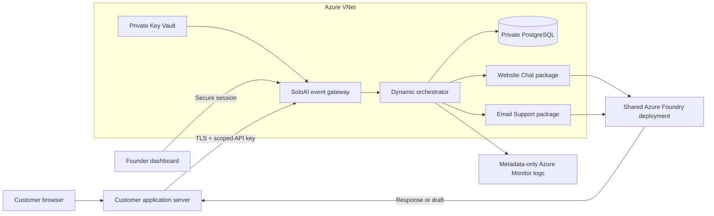

# Architecture and trust boundaries

> SoloAI is the plug-and-play AI control plane for founders who can build software with AI but don't want to become AI infrastructure engineers.

One FastAPI process serves the static dashboard, account endpoints, event gateway and synchronous orchestrator. Azure Container Apps runs 1–3 replicas; PostgreSQL is the coordination point. This avoids a separate orchestrator service, per-customer infrastructure, Redis or Kubernetes at MVP scale. SQLite is for local demonstration only.

The current application supports **one owner per tenant**. Registration creates a tenant and disabled agent instances. Dashboard authorization derives the tenant from an opaque, hashed session. Integration authorization derives it from a hashed server-side key. Request bodies cannot choose a tenant. Queries include the trusted tenant. This is application-enforced isolation, not PostgreSQL row-level security, separate databases, or a claim of independently audited isolation.

## Execution lifecycle

1. Validate a bounded request and authenticate the key/session.
2. Match the event against a server-owned package trigger.
3. Load the tenant's enabled agent configuration.
4. Atomically reserve a conservative text-token budget and increment the shared minute counter.
5. Call the shared model with package instructions and tenant business guidance. No arbitrary tool execution is available.
6. Recheck enabled state and emergency-stop generation before returning output.
7. Record status, latency and total tokens; refund unused reservation when actual usage is known.

Failed/ambiguous calls keep their reservation to avoid undercharging an unknown provider outcome. A process crash may leave an execution marked running and tokens reserved. Operators must reconcile against provider usage; do not blindly refund. No automatic event retry or exactly-once guarantee is claimed. Adding idempotency requires a conscious response-retention policy. The SDK intentionally does not retry requests.

The token estimate uses UTF-8 byte length plus message overhead and a 1,024 output ceiling. It is conservative for ordinary text supported by this endpoint, not a universal tokenizer. Vision, files, tool schemas and arbitrary model APIs are unsupported. Model compatibility and token reconciliation need live verification for each selected deployment.

## Packages and marketplace

The server-owned `PACKAGES` registry defines identifiers, event triggers, instructions, allowed operations and descriptions. Instances reference a package plus tenant guidance and enabled state. The model deployment is an operator-owned environment setting; founders do not need to select models. Both MVP agents use the same endpoint.

Package permissions are deliberately fixed: Website Chat can respond, and Email Support can read the supplied email event and produce a draft. There is no send/delete tool, database connector, URL fetcher, or user-supplied executable package. Displayed permissions describe enforced available capabilities. Installing untrusted marketplace code is not supported.

Before third-party publishing: introduce versioned manifest validation, signed packages, explicit capability declarations, connector credential scopes, review and revocation, sandboxed tool execution, and per-tool audit events. Do not interpret a package's text declaration as sufficient authorization.

## Scale only when needed

- Start with the single service and a modest PostgreSQL instance. Load-test the real model's latency and connection requirements before increasing replicas.
- Add a queue and worker for long-running inbox tasks, with deduplication, explicit short-lived encrypted payload retention, cancellation and reconciliation.
- Add tenant membership/RBAC, RLS using a non-owner database role, account recovery/verified signup, and distributed admission controls before public self-service.
- Add connector OAuth authorization-code flow with state, PKCE where supported, least-privilege scopes, encrypted refresh tokens and revocation. Gmail/Outlook OAuth is a future milestone, not a working feature in this repository.
- Offer dedicated model endpoints or infrastructure only when enterprise requirements justify them.
