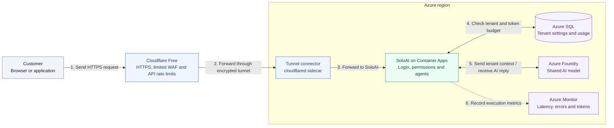
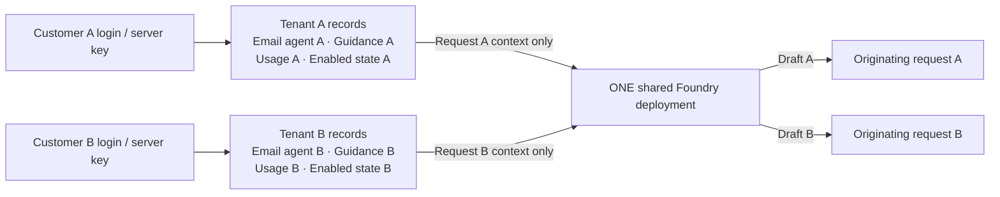
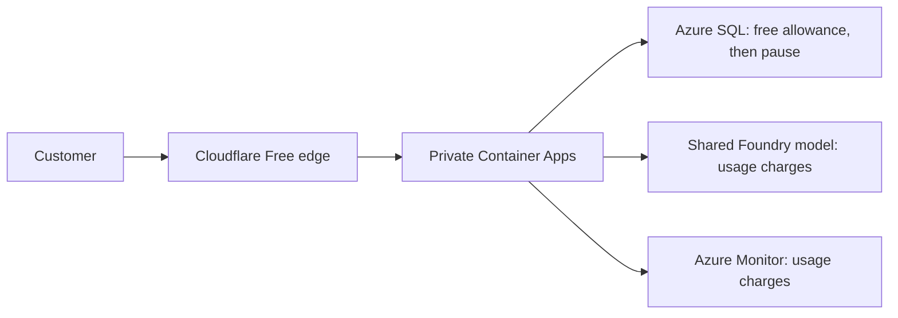
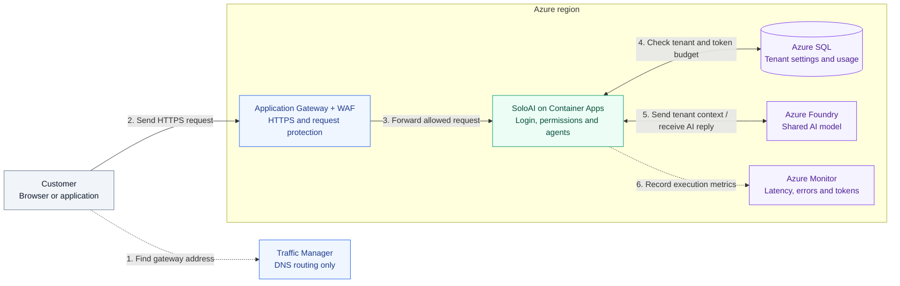

# SoloAI: minimal secure architecture

> **SoloAI is the plug-and-play AI control plane for founders who can build software with AI but don't want to become AI infrastructure engineers.**

## The starting design



**Read the numbered steps from 1 to 6.** Cloudflare checks the request before
forwarding it. The connector establishes the tunnel **outbound from Azure**;
step 2 shows the request travelling through that existing connection. The connector
and SoloAI run in the same replica, and the app has no public ingress.

The reply follows the same route back: **SoloAI → Tunnel connector → Cloudflare → Customer**.
SQL and Foundry use private connections. SoloAI records actual token usage in SQL
after the model call and sends operational metadata to Azure Monitor. Key Vault,
managed identity and private DNS support the design but are omitted for readability.


**Cloudflare is the public entry point.** HTTPS is enforced and response caching is disabled for the app hostname. The Free Managed Ruleset is a limited ruleset, not the full paid OWASP offering. One rate rule covers `/api/` paths. A cloudflared sidecar opens outbound tunnel connections and forwards to localhost:8000. The Container App has no managed ingress, and its environment is internal with public access disabled. See [Cloudflare setup](CLOUDFLARE.md) for account prerequisites and limits.

The app uses private DNS/TLS for Azure SQL, Key Vault and model access. The AI account owner disables public and API-key access; Terraform refuses an account that does not meet those conditions. No model key is supplied to the application. ACR is reused with identity-based pulls; this minimal stack does not add an ACR private endpoint or an outbound Azure Firewall.

## Keep only what is needed

| Component | Why it stays |
|---|---|
| Cloudflare Free + Tunnel | Free public edge, limited managed rules, API rate control and outbound tunnel |
| Container Apps | One service for dashboard, login, API and orchestrator; scale replicas without managing servers |
| Azure SQL | Persistent tenant configuration, authentication metadata and shared usage counters |
| Shared Azure OpenAI deployment | One inference backend for every tenant |
| Managed identity + Key Vault | Scoped Azure access and private secret storage |
| VNet, private endpoints and DNS | Private app/data/model connectivity |
| Existing ACR | Deliver the built image |
| Log Analytics + failure alert | Basic operations; optional email recipient |

Removed the unused Application Insights resource and optional HA configuration switches. No AKS, API Management, Redis, Service Bus, separate worker, second region or dedicated infrastructure per tenant. Cloudflare Free replaces the paid Azure edge. Always-running Azure compute, private endpoints, logs and model usage still have charges.

## Request workflow

```mermaid
sequenceDiagram
    participant User as Internet client
    participant Edge as Cloudflare Free WAF
    participant App as SoloAI Container App
    participant DB as Private Azure SQL
    participant AI as Private shared Foundry model

    User->>Edge: HTTPS request
    alt Suspicious or excessive IP traffic
      Edge-->>User: Block before origin
    else Allowed request
      Edge->>App: Encrypted tunnel; localhost forwarding
      App->>DB: Authenticate session/key and resolve tenant
      App->>DB: Load enabled agent; atomically reserve tenant usage
      alt Disabled / unauthorized / out of allowance
        App-->>Edge: Reject; no model call
      else Admitted event
        Note over App,DB: Commit reservation before waiting for the model
        App->>AI: Managed identity + tenant-specific guidance/message
        AI-->>App: Chat reply or email draft
        App->>DB: Recheck stop state; record usage/status/latency
        App-->>Edge: Return response on originating request
      end
      Edge-->>User: Response; no CDN caching
    end
```

WAF is an HTTP security control, not a prompt-injection defense or tenant authorization system. SQL-backed limits remain mandatory: WAF counters are approximate and grouped by socket IP; many customers can share a NAT address. The app separately enforces 20 events/minute and a 10,000-token lifetime starter allowance per tenant. Shared Foundry quota can still be exhausted by aggregate traffic.

## When multiple users sign up and enable agents



Registration creates one tenant and two disabled agent rows. Logging in creates a session; enabling an agent updates its row. **None of these actions runs Terraform or deploys a new Azure model/container.** Any app replica can handle the next request because sessions, configuration and counters are shared in Azure SQL.

| Setting | What is separate today? |
|---|---|
| `tenant_id` | Derived by the server from the session/key; never trusted from event payloads |
| Agent instance | Composite key `(tenant, agent_id)` |
| Guidance and enabled state | Tenant-owned configuration |
| Permissions | Fixed package capabilities: respond, or read supplied email and draft; no send/delete tool |
| Connected tools | None yet; Gmail/Outlook/CRM OAuth is planned, not implemented |
| Prompt context | Shared package instructions plus only that tenant's guidance and current message |
| Usage and executions | Separate tenant counters and metadata rows |
| Model deployment | Same endpoint and shared Azure quota |

Future connectors must store credentials and permissions with a tenant owner, using OAuth and encrypted tokens. Sharing a model must never imply sharing mailbox credentials or customer context. Current isolation is enforced by application queries, not Azure SQL RLS or individual Azure identities. This remains a security boundary that needs testing and further hardening before public production.

## Reliability and scaling decisions

| Situation | Current behavior / limit |
|---|---|
| More founders or enabled agents | More configuration rows; no new infrastructure |
| More simultaneous events | Increase min_replicas manually; HTTP autoscaling is not configured because tunnel traffic bypasses managed ingress |
| Two requests spend the same tenant balance | Conditional SQL reservation coordinates them across replicas |
| Heavy traffic across all tenants | May exhaust model quota or database connections; more replicas do not increase either |
| Azure SQL outage | Process readiness stays up; database-backed requests fail without bypassing auth/config/limits |
| Model timeout or failure | Generic failure; no automatic retry or durable replay |
| Process dies during inference | Tokens can remain reserved and execution `running`; reconcile before refunds |
| Emergency stop | Blocks new work and suppresses checked in-flight output; an existing model call can still consume tokens |
| Regional outage | No failover; this starter is single-region and database HA is off |
| Restore needed | Seven-day DB backups; restore drills are still required |

Start small, measure p95 latency, DB connections/CPU, failed executions and provider throttling, then change the bottleneck. Two app replicas can improve availability, but this template does not promise zone redundancy or a specific user capacity. Add durable queues, fair global admission and HA when real demand justifies them.

The existing login limiter uses the immediate peer address. Managed ingress can make multiple people appear to share that address; WAF does not fix this application limitation. Trusted-proxy-aware login protection, a least-privilege DB runtime role, verified identity/recovery and RLS remain launch work.

Customer messages/replies are transient in the application, not written to SQL or console logs. Guidance is intentionally persisted configuration. Model-provider retention is separate. No raw request/body logging is enabled by this template. Cloudflare processes requests at its edge; its retention policies are separate from SoloAI. Inspect edge events in Cloudflare and application metrics in Azure.

## Code and deployment

- [Readable Terraform files](../infra/terraform/README.md)
- [Deployment, tunnel setup and upgrade instructions](AZURE.md)
- [Runtime and tenant-scoped queries](../app/main.py), [package permissions](../app/packages.py), [security limitations](../SECURITY.md)

The diagrams describe the current **Terraform target**. They are not evidence of a live deployment. Bicep also uses a tunnel sidecar, but remains a legacy PostgreSQL variant. Cloudflare resources must be configured separately for Bicep.

## Free edge and database allowance

The database is Azure SQL with a monthly free allowance and stop-at-limit behavior.
If it exhausts that allowance, the platform loses database-backed functionality until
the allowance resets. Connection pooling is disabled for this backend, and readiness
probes do not query it, so idle traffic checks do not keep the database awake.

> **Note:** Cloudflare Free has no edge subscription charge. Private endpoints, compute, logs
> and Foundry usage are separate costs. This is not a zero-cost Azure stack.



See [Azure SQL setup](AZURE-SQL.md) for connection settings and existing-data migration precautions.

## Azure-native alternative: Traffic Manager and Application Gateway

This is an optional future design, not the current Terraform or Bicep deployment.
Here, Azure gateway means **Application Gateway WAF_v2**, not VPN Gateway or API
Management. It replaces Cloudflare and its tunnel. Traffic Manager selects a regional
gateway through DNS; the browser sends HTTPS directly to that gateway.



**Read the numbered steps from 1 to 6.** Step 1 is a DNS lookup that returns the
selected gateway address. The HTTPS request starts at step 2 and never passes
through Traffic Manager. After processing, the reply returns along the same route:
**SoloAI → Application Gateway → Customer**.

SQL, Foundry and the app backend use private connections. Key Vault, managed identity
and private DNS support these connections but are omitted from the diagram to keep
the request flow readable. SoloAI records actual usage in SQL after the model call;
Azure Monitor receives operational metadata, not customer messages.

Application Gateway inspects HTTP requests and forwards allowed traffic to the
internal Container Apps environment. Configure backend DNS, TLS host names,
certificates and health probes correctly, and restrict backend access to the gateway
network. Unlike the tunnel deployment, this variant needs managed app ingress
reachable from the gateway's VNet. Remove the cloudflared sidecar in that variant.

Traffic Manager does not proxy traffic, terminate TLS or provide a WAF. DNS caching,
TTL and health detection affect failover time; existing connections do not move
automatically. Each gateway needs a certificate for the public application hostname.
See Microsoft's [Application Gateway overview](https://learn.microsoft.com/en-us/azure/application-gateway/overview)
and [multiregion design](https://learn.microsoft.com/en-us/azure/architecture/high-availability/traffic-manager-application-gateway).

Start with one regional gateway if Azure-native ingress is required. Traffic Manager
adds meaningful regional failover only when a second working endpoint exists.
A second gateway alone does **not** protect against a full regional outage when
SQL and the model remain in the primary region. Regional recovery would require a
tested SQL replication/failover design, a secondary model deployment with available
quota, regional secrets and coordinated application recovery. Gateway `/live` probes
alone cannot establish that those dependencies are usable.

Multiple customers still share app replicas and the model endpoint. Authentication
resolves each tenant, and SQL coordinates permissions, configuration and token limits.
Gateway scaling does not increase model quota or database capacity. Monitor each
layer before adding replicas or capacity.

**Cost note:** Application Gateway WAF_v2 and Traffic Manager are paid services.
A second region adds compute and networking costs. This diagram is an Azure-native
option for future requirements, not a free replacement for the current Cloudflare edge.
