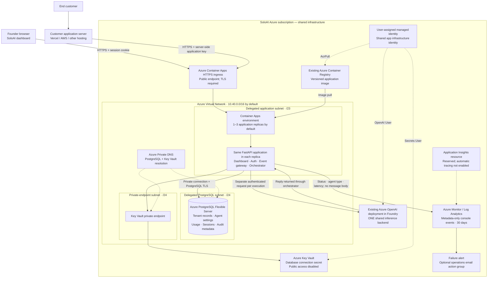
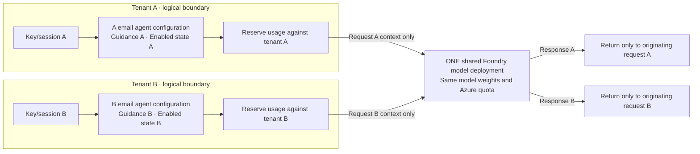
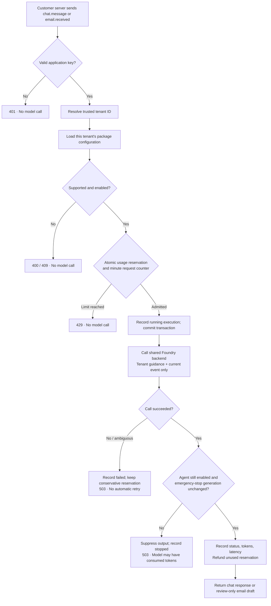

# SoloAI architecture

> **SoloAI is the plug-and-play AI control plane for founders who can build software with AI but don't want to become AI infrastructure engineers.**

SoloAI is one shared SaaS control plane. A customer's application stays on its own infrastructure. A customer gets tenant-scoped database records and agent configuration; signing up or enabling an agent does **not** create an Azure server, model deployment, or Terraform resource.

These diagrams describe the implemented application and the Azure infrastructure defined in this repository. Azure deployment has not been verified in a live subscription. “Planned” features below are not current capabilities.

## 1. Azure services and network boundaries



**Public/private is explicit:** the SaaS HTTPS endpoint is public. PostgreSQL and Key Vault have public network access disabled. VNet membership alone is not a firewall or tenant boundary. The existing Foundry resource retains its existing network policy; these templates do not provision a private model endpoint or change a shared model's firewall. ACR is an existing registry. Neither WAF nor outbound Azure Firewall filtering is included.

| Service | Why it is here | Current boundary |
|---|---|---|
| Azure Container Apps | Run and scale one containerized service without Kubernetes operations | Default 1–3 shared replicas; no per-tenant compute |
| PostgreSQL Flexible Server | Durable configuration, session lookup, atomic quota reservations | Private network; application-enforced tenant scoping; no RLS yet |
| Foundry / Azure OpenAI | Shared text generation backend | Deployment name and endpoint are operator-owned; requests carry separate tenant guidance |
| Managed identity | Authenticate app-to-Azure calls without embedded model keys | Shared infrastructure principal; does not identify individual founders |
| Key Vault | Store the database connection secret | Private endpoint, RBAC, purge protection; runtime identity reads only |
| ACR | Store the built container image | Existing registry; app uses AcrPull |
| VNet and Private DNS | Route and resolve private data services | Separate delegated subnets and private-endpoint subnet |
| Monitor / Log Analytics | Observe execution failures and latency | No customer messages logged; provider retention is separate |
| Application Insights | Reserved extension point | Resource exists; automatic tracing is not implemented |

## 2. What happens when customers sign up and enable agents?

```mermaid
sequenceDiagram
    actor A as Founder A
    actor B as Founder B
    participant App as Any SoloAI replica
    participant DB as Shared PostgreSQL
    participant Model as Shared Foundry deployment

    par Independent signup A
      A->>App: Register workspace
      App->>DB: Create tenant A + owner credentials
      App->>DB: Insert disabled chat/email rows keyed by tenant A
      App-->>A: Opaque session cookie
    and Independent signup B
      B->>App: Register workspace
      App->>DB: Create tenant B + owner credentials
      App->>DB: Insert disabled chat/email rows keyed by tenant B
      App-->>B: Different opaque session cookie
    end

    A->>App: Enable Email Support + guidance A
    App->>DB: Resolve session to A; update only (A, email-support)
    B->>App: Enable Email Support + guidance B
    App->>DB: Resolve session to B; update only (B, email-support)
    Note over DB,Model: Configuration changes only. No Azure resource or model is created.

    par Event for A
      A->>App: Application event authenticated with key A
      App->>DB: Resolve A; read A config; reserve A usage
      App->>Model: Email package instructions + guidance A + message A
      Model-->>App: Draft A
      App->>DB: Recheck A state; record A usage/status
      App-->>A: Return draft A on originating request
    and Event for B
      B->>App: Application event authenticated with key B
      App->>DB: Resolve B; read B config; reserve B usage
      App->>Model: Email package instructions + guidance B + message B
      Model-->>App: Draft B
      App->>DB: Recheck B state; record B usage/status
      App-->>B: Return draft B on originating request
    end
```

The two requests may run on the same or different replicas. No sticky session is required: session hashes, key hashes and configuration live in PostgreSQL. Logging in again creates a session, not a tenant or new agent instances. The current MVP pre-creates its two disabled agent rows during registration; the store's “configure” action enables those rows. Arbitrary agent creation is not implemented.

### Shared model, logically separate customers



| Dimension | Customer A | Customer B | Implementation today |
|---|---|---|---|
| `tenant_id` | A | B | Server-generated; derived from session/key, not accepted from the event body |
| Agent instance | `(A, email-support)` | `(B, email-support)` | Composite primary key in `agents` |
| Guidance and enabled state | A's values | B's values | Tenant-scoped `guidance` and `enabled` columns |
| Permissions | Read supplied email, draft | Read supplied email, draft | Fixed first-party package capabilities; not yet independently configurable per tenant |
| Connected tools | None | None | No Gmail/Outlook/CRM credential records or arbitrary tools yet |
| Instructions | Email package + A's guidance | Same package + B's guidance | Constructed per request; no shared conversation history |
| Usage allowance | A's own usage counter | B's own usage counter | 10,000 lifetime starter tokens and 20 events/minute for each tenant |
| Model endpoint | Shared endpoint | Same endpoint | Deployment-level Azure quota is shared; no tenant fine-tuning or model instance |
| Executions and audit | A-scoped rows | B-scoped rows | Bodies excluded; each read/write filters by trusted tenant |

**The intended connector extension:** A could later authorize Gmail and an order API while B authorizes Outlook and a CRM. That needs tenant-owned connector records, OAuth token encryption, explicit tool permissions and backend enforcement. The diagram does not imply those connectors already work. A database row must carry its tenant owner even when the package type is shared.

Logical isolation depends on correct application authorization and queries. Azure's shared identity/model does not enforce SoloAI's tenant boundaries. There is no PostgreSQL RLS or separate database per tenant in this MVP. A query bug can therefore be a cross-tenant security issue; tenant-boundary tests are necessary, and RLS with a non-owner runtime role is a planned defense.

## 3. Event workflow and failure decisions



A DB transaction ends **before** the network model call. Reservations use conditional SQL updates on the tenant row, so competing requests on multiple replicas cannot each spend the same remaining allowance. Contention for one tenant is separate from another tenant's row. The database instance, connection pool, CPU and model quota remain shared bottlenecks.

The text budget is conservative UTF-8 byte length plus message overhead and a 1,024 output-token ceiling. It is not a universal tokenizer for vision, files or arbitrary model protocols. Verify usage reconciliation for the selected deployment. Provider-side 429s and timeouts are currently reported as a generic 503; structured provider errors and backpressure are future work.

## 4. Reliability: what is and is not guaranteed

| Event | Existing behavior | Operational decision / limitation |
|---|---|---|
| Replica fails before admitting work | Another healthy replica can serve later requests | Default minimum is one; use two for better replica availability |
| Process dies during inference | Execution may stay `running`; reserved tokens remain | No durable queue or automatic recovery; reconcile with provider usage before refunds |
| PostgreSQL is unavailable | Readiness fails; auth/config/usage operations cannot safely proceed | Fail closed; no fallback that bypasses tenant checks or limits |
| Model is slow or unavailable | HTTP client timeout is configured; failure returned | No automatic retries, circuit breaker or regional failover |
| Customer presses emergency stop | New work disabled; in-flight output checked before return | Already-started model call is not cancelled and can cost tokens |
| Request is sent twice | It can execute twice | SDK does not retry; no idempotency or exactly-once guarantee |
| Database fails | Default Burstable server is not HA; backups retain seven days | Terraform supports optional zone-redundant HA on a compatible SKU/region |
| Region fails | Single-region service can be unavailable | No secondary region or geo-redundant backups by default |
| Alert fires | Portal alert; email if Terraform `alert_email` is set | Test delivery and tune thresholds; no invented on-call destination |

Backups are not an RTO/RPO guarantee. Restore drills, measured recovery objectives, fault injection and staging load tests are required before making availability commitments. Terraform's `prevent_destroy` protects against planned deletion, not outages or malicious access. App minimum replicas do not themselves promise cross-zone placement; Container Apps zone redundancy is not enabled in this template.

## 5. Scalability and noisy neighbors

- **More founders:** registration inserts one tenant and two agent rows. No infrastructure deployment runs. Account login performs password verification and a shared session write; it is not a model call.
- **More enabled agents:** configuration grows in SQL. Disabled agents consume no inference tokens. Installed/enabled rows do not imply a background worker or open model session.
- **More simultaneous events:** Container Apps targets 20 concurrent HTTP requests per replica and scales from 1 to 3 by default. This target is a scaling signal, not an admission cap. Terraform exposes replica limits and the target.
- **One heavy tenant:** the database enforces that tenant's minute counter and lifetime token allowance across replicas. This limits individual usage but does not guarantee fair scheduling among all tenants.
- **Many active tenants:** total traffic can exceed shared Foundry TPM/RPM quota even if every tenant is below its own limit. More app replicas do not increase model quota. Add global admission/backpressure and fair queues when measured demand requires it.
- **Database capacity:** more replicas create more connection pools. The current synchronous SQL calls in the async event path and CPU-heavy password hashing also impose practical throughput limits. Measure these before raising the replica ceiling; do not infer user capacity from replica count.
- **Login abuse:** the current limiter uses the immediate peer address and ignores forwarded headers. Behind managed ingress, users may share that peer address and throttle each other. Trusted-proxy-aware edge identity/rate limiting is a launch requirement, not solved by Terraform.

There is no validated claim that this MVP supports a specific number of users. Start with load tests using representative login/event rates and model latency. Watch p95 latency, failed execution count, database CPU/connections, model throttling and reserved-token accumulation. Raise capacity only at the measured bottleneck.

## 6. Design decisions

| Decision | Benefit | Tradeoff and next step |
|---|---|---|
| One FastAPI service | Fewer services, deployments and operational failure modes | Split long-running work into a queue/worker only when needed |
| Shared Foundry deployment | No model provisioning per customer; simpler operations | Shared quota/failure domain; enterprise isolation can come later |
| PostgreSQL as configuration and coordination store | Durable state; limits work across replicas | DB availability and connection capacity matter; add RLS and a dedicated runtime role |
| First-party package registry | Predictable triggers and enforced available operations | Third-party manifests require signing, review, sandboxing and revocation |
| Email drafts only | No accidental automatic sending capability | Live inbox integration and human approval flow are future milestones |
| Transient business content | No message/response archive in SoloAI SQL or logs | No replay or stored conversation memory; durable jobs need an explicit retention policy |
| One Terraform root split by concern | Readable ownership and one environment plan | Extract modules only when real reuse or separate lifecycles justify them |
| Azure Blob remote state | Shared state with lease-based locking | State contains secrets: restrict access, enable recovery and keep it out of Git |

Tenant guidance is intentionally persisted configuration; never put credentials or sensitive customer records in it. Operational metadata cleanup is a documented operator job, not a deployed scheduler. Azure model processing/abuse-monitoring retention is separate from SoloAI's application retention.

## Implementation and infrastructure references

- [Runtime and database queries](../app/main.py), [first-party packages](../app/packages.py), [security boundaries](../SECURITY.md).
- [Terraform root and runbook](../infra/terraform/README.md), [Bicep deployment](AZURE.md). Choose one owner per resource; never apply both to the same resources.
- [Azure Container Apps scaling](https://learn.microsoft.com/en-us/azure/container-apps/scale-app).
- [PostgreSQL high availability](https://learn.microsoft.com/en-us/azure/postgresql/flexible-server/concepts-high-availability).
- [Azure OpenAI quotas](https://learn.microsoft.com/en-us/azure/ai-foundry/openai/quotas-limits).
