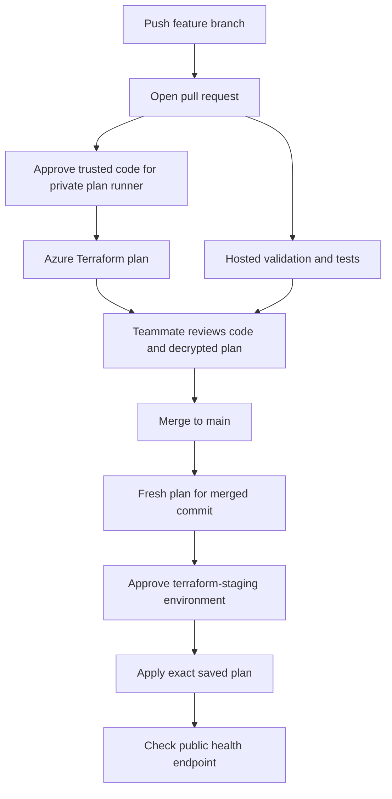

# Terraform delivery through GitHub Actions

The `Terraform delivery` workflow is committed but opt-in. It does not provision
runners, configure GitHub protections, create Azure identities or bootstrap state.
Existing hosted CI still runs without Azure credentials.



## One-time operator setup

1. Bootstrap an Azure Blob state container outside this Terraform root, with Entra
   authentication and private network access. Use one key per environment. Blob leases
   provide state locking. Never use `force-unlock` without investigating the holder.
2. Supply an isolated, preferably ephemeral Linux x64 GitHub runner labelled
   `soloai-private`, with private DNS/VNet access to state, Key Vault and Azure SQL,
   plus outbound access to Azure management APIs, GitHub and Terraform providers.
   Install bash, Python 3, OpenSSL, curl and sha256sum. Do not share this runner with
   untrusted repositories or mount developer credentials on it.
3. Create two Azure federated identities. Use issuer `https://token.actions.githubusercontent.com`
   and audience `api://AzureADTokenExchange`. Subjects for this repository:
   - Plan: `repo:sumitsharma01/soloai:environment:terraform-plan`
   - Apply: `repo:sumitsharma01/soloai:environment:terraform-staging`
   The workflow obtains OIDC credentials directly through Terraform; no client secret
   or `az login` step is needed.
4. Scope plan identity to reading the managed resources and secrets needed for refresh,
   and state-container Blob Data Contributor for locking. Plan reads are sensitive:
   Terraform may need existing secret values. Scope apply permissions to the deployment
   resource group and explicitly required shared resources, with permission to manage
   the role assignments this root declares. Avoid subscription Owner. Both identities
   require state access. Pre-register the Azure providers used by the stack.
5. Create GitHub environments `terraform-plan` and `terraform-staging`. Require trusted
   reviewers on **both**, and prevent self-review where supported. Plan approval must
   inspect PR code, scripts, provider changes and workflow changes before any private
   runner executes them. Same-repository PRs can still contain malicious code. Fork PRs
   never run this workflow's private jobs. Restrict staging to main; permit reviewed
   PR refs plus main for the plan environment. Availability of protection features
   depends on repository visibility and GitHub plan.
6. Protect main: require PR review, hosted CI checks and the Terraform plan check for
   infrastructure PRs. Because this workflow uses path filters, do not make its check
   mandatory for unrelated PRs unless rules account for skipped workflows. Require
   CODEOWNERS review of workflows, scripts and infrastructure; add real teammate handles
   to CODEOWNERS rather than placeholders. Disallow bypass/direct pushes as appropriate.

## Repository variables

| Variable | Value |
|---|---|
| `TERRAFORM_DELIVERY_ENABLED` | `true` only after all setup is complete |
| `AZURE_TENANT_ID` | Entra tenant UUID |
| `AZURE_SUBSCRIPTION_ID` | Target subscription UUID |
| `AZURE_PLAN_CLIENT_ID` | Plan federated application's client UUID |
| `AZURE_APPLY_CLIENT_ID` | Apply federated application's client UUID |
| `TF_STATE_ACCOUNT` | Existing state storage account |
| `TF_STATE_CONTAINER` | Existing blob container |
| `TF_STATE_KEY` | e.g. `soloai/staging.tfstate` |
| `TF_CONFIG_JSON` | JSON object of reviewed, non-secret Terraform inputs |

Populate `TF_CONFIG_JSON` using `infra/terraform/terraform.tfvars.example`: resource
names, prefix, existing registry/model, immutable container image, scale limits and
schema setting. Do not include subscription_id (provided separately), passwords or
connection strings. Variables are operational inputs: control who can edit them.

## Environment secrets

- `terraform-plan`: `TF_DATABASE_ADMIN_PASSWORD`, the existing staging bootstrap
  database password; and `TF_PLAN_ENCRYPTION_KEY`, a strong randomly generated secret.
- `terraform-staging`: the **same** `TF_PLAN_ENCRYPTION_KEY` for decryption.

The initial workflow targets the root's existing staging bootstrap database mode.
A production runtime connection secret needs explicit secret injection into the plan
job before switching to that mode; never put it in `TF_CONFIG_JSON`.

## Reviewing plans

Logs show only action counts. Download the encrypted artifact from the particular
run and attempt onto a trusted workstation. Obtain the encryption secret through
an approved secret channel, inject it as `PLAN_ENCRYPTION_KEY`, and run:

```bash
sha256sum -c plan.enc.sha256
openssl enc -d -aes-256-cbc -pbkdf2 -iter 200000 \
  -in plan.enc -out review.tfplan -pass env:PLAN_ENCRYPTION_KEY
terraform show review.tfplan
```

Use Terraform 1.15.8 and matching provider initialization to inspect the plan. Do not
upload plaintext plans or their JSON to PR comments. Remove decrypted files after
review. Artifacts expire in one day: approve within that period or start a new full
workflow run. The hash detects accidental corruption, not a malicious trusted actor;
artifact access and GitHub protections remain the trust boundary.

After merge, approve the **new main plan**, not just the earlier PR plan. The apply
job downloads only its own run/attempt artifact, checks it and applies that saved plan.
Workflow concurrency serializes this state; cancellation is disabled. Terraform also
rejects stale plans. After failure, investigate partial state and start a fresh full
run; do not assume rollback. Re-running just apply is intentionally not supported by
the attempt-specific artifact naming.

First deployment health may fail until Front Door's private-link approval and DNS
propagation are complete. That is a verification failure, not automatic rollback.
The repository instructions still govern that manual approval. No application image
is built by this workflow: publish a reviewed image separately and update its input.

Validation in this change: shell syntax, YAML parsing, Terraform validation/tests.
End-to-end OIDC, private runner access, GitHub approvals and Azure apply require the
above account configuration and have not been executed by this change.
