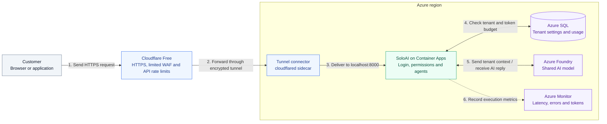

# Cloudflare Free edge

Cloudflare Free replaces Azure Front Door Premium. No paid Cloudflare subscription
or Azure edge resource is created. Azure compute, private endpoints, SQL beyond any
applicable allowance, logs and model usage are separate. Domain registration is also
separate. At least one app replica runs continuously for the tunnel.

**Read the numbered steps from 1 to 6.** Cloudflare checks the request before
forwarding it. The connector establishes the tunnel **outbound from Azure**;
step 2 shows the request travelling through that existing connection. The connector
and SoloAI run in the same replica, and the app has no public ingress.

The reply follows the same route back: **SoloAI → Tunnel connector → Cloudflare → Customer**.
SQL and Foundry use private connections. SoloAI records actual token usage in SQL
after the model call and sends operational metadata to Azure Monitor. Key Vault,
managed identity and private DNS support the design but are omitted for readability.

## Terraform setup

1. Add a domain you own to Cloudflare on the Free plan and activate its nameservers.
2. Copy the account ID and zone ID into the Terraform inputs. Set `public_hostname`
   to an unused hostname in that zone, such as `soloai.example.com`.
3. Create a scoped API token for this account and zone. Apply needs Cloudflare Tunnel
   Edit, DNS Edit, Zone Settings Edit, Cache Rules Edit and WAF/rate-rule Edit permissions.
   Plan needs corresponding reads, including access to the tunnel connector token.
   Export it as `CLOUDFLARE_API_TOKEN` using your secret manager, never a tfvars file.
4. Set `cloudflared_image` to a reviewed version or digest. The example is a pin,
   not an automatic security update policy. Update it regularly after review.
5. Review the plan, including existing DNS and rulesets, then follow [Azure deployment](AZURE.md).
6. Verify tunnel health, DNS, edge certificate, HTTPS redirects and the Free Managed
   Ruleset in the Cloudflare dashboard. Test login and an agent request end to end.

Terraform creates a remotely managed tunnel, retrieves its connector token as a
sensitive value and supplies it to an Azure Container Apps secret. The management
API token is not passed to the app. Protect state and saved plans because they contain
the connector token. Rotate a compromised token and roll the app revision.

The connector opens outbound connections; no inbound app ingress is configured.
Allow Cloudflare Tunnel egress, including port 7844, plus required Azure endpoints.
The final tunnel route returns 404 for unmatched hostnames. Local forwarding is HTTP
inside the same replica; internet traffic uses HTTPS and the tunnel is encrypted.

## Free-plan limits and existing zones

The Free Managed Ruleset is a limited subset of managed attack protection. It is not
the full paid managed/OWASP ruleset and is not a prompt-injection defense. Verify it
is enabled: an existing zone may have disabled it. Terraform does not upgrade plans.

The single rate rule blocks `/api/` traffic over 50 requests per 10 seconds per IP
and Cloudflare location, for 10 seconds. It is approximate, not a token-budget control.
The Free plan rule applies across the zone's `/api/` paths, including other hostnames.
Prefer a dedicated zone for this setup. Shared NAT users share limits.

Terraform owns the zone rate-limit and cache rulesets and the always-use-HTTPS setting.
For a zone with existing rules, import and merge them before applying. Do not replace
another application's rules or attempt to create a second rate rule on the Free plan.
Cache bypass is restricted to the SoloAI hostname. No response content should be cached.

The app's current login limiter uses the immediate peer address. Behind the connector,
users can share that address. Trusted-proxy-aware login limits remain launch work;
Cloudflare does not fix the application limiter. Tenant usage limits remain SQL-backed.

## Bicep

Bicep deploys the Azure connector sidecar, not Cloudflare resources. Configure the same
tunnel route and edge settings in Cloudflare first, then pass `cloudflareTunnelToken`
as a secure parameter and `cloudflaredImage` as a pinned image. The legacy pipeline
passes these through its private parameter file. Do not use both IaC tools to own the
same Azure resources. Bicep still uses the legacy PostgreSQL database design.

## Reliability

Tunnel traffic bypasses Container Apps HTTP ingress, so HTTP autoscaling is removed.
Increase `min_replicas` for additional app/connector replicas after measuring load.
`max_replicas` is only a ceiling, not an autoscaling policy. Tunnel availability,
Cloudflare limits, Azure availability and model quotas all affect the request path.
The Free plan does not provide a production availability guarantee for this platform.

References: [Tunnel Terraform setup](https://developers.cloudflare.com/tunnel/deployment-guides/terraform/),
[WAF availability](https://developers.cloudflare.com/waf/),
[rate-limit parameters](https://developers.cloudflare.com/waf/rate-limiting-rules/parameters/).
