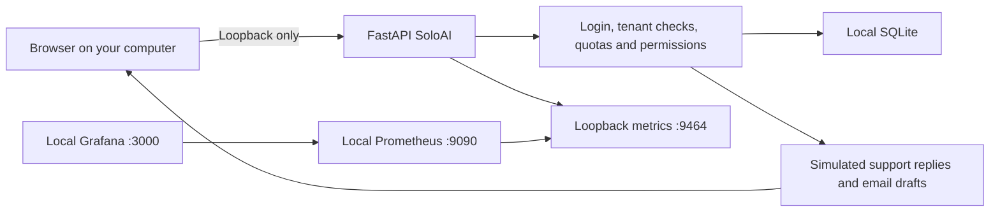

# Zero-cloud-cost local architecture

This mode uses your existing computer, not hosted free-tier promises. There are no
cloud service or model API calls. Hardware, electricity and internet are still yours.
AI responses are explicitly simulated: this is a functional platform demonstration,
not a free live Foundry agent. The Azure deployment remains optional and billable.



| Component | Local replacement | Security boundary |
|---|---|---|
| Cloudflare Free WAF | No public ingress | Bind only to 127.0.0.1 |
| Container Apps | Local Python process | Current OS user; no public listener |
| PostgreSQL | SQLite | Local file; tenant-scoped SQL |
| Foundry | Deterministic demo responder | No provider credentials or paid inference |
| Azure Monitor | Prometheus + Grafana | Loopback metrics and read-only local dashboard |
| Key Vault | No Azure secrets needed | Keep any unrelated credentials outside this mode |

## Start

Activate the virtual environment in the README, install requirements, stop any
existing process using ports 8000 and 9464, then run:

```bash
bash scripts/run-free-local.sh
```

Open http://127.0.0.1:8000 and create a workspace. This profile uses a separate
`soloai-free.db` so your live profile and existing data remain intact. Add business
guidance and enable agents. Replies are labelled simulated. Monitoring is started
separately using [the local monitoring guide](../monitoring/README.md).

Passwords are hashed; login cookies are HTTP-only and SameSite Strict. Tenant checks,
body limits, origin checks, agent permissions, quotas and emergency stop remain active.
Loopback HTTP is for local use only. Do not port-forward these services: this profile
has no public HTTPS gateway/WAF, managed backups or production availability guarantee.
Anyone with local OS access may access local files or read the local monitoring view.

## Public hosting is a separate decision

A public deployment requires a hosting provider, storage, HTTPS, operational security
and an AI backend. Free quotas may be available but can expire, sleep, restrict usage
or require payment details. No public provider has been selected or deployed here.
For real AI without API charges, a local model is a possible later adapter, with its
own hardware needs and quality/security evaluation. It is not implemented by this mode.

No existing Azure resources are deleted. Selecting this mode does not stop charges
for resources you created independently; inspect Azure billing before removing them.
Keep `TERRAFORM_DELIVERY_ENABLED` unset/false to prevent paid infrastructure deployment.
