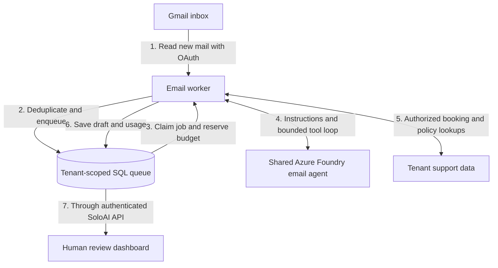
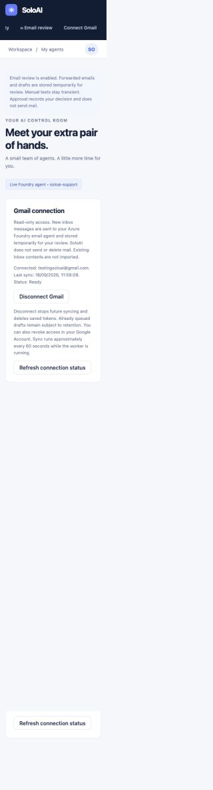
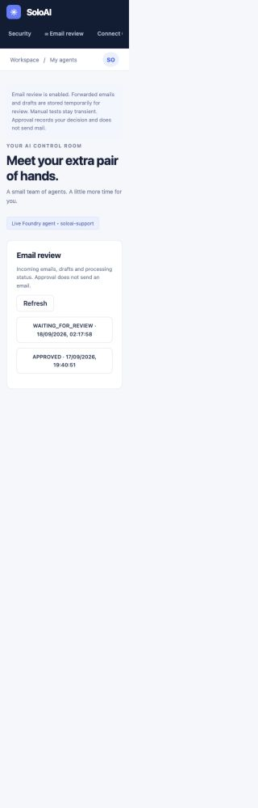
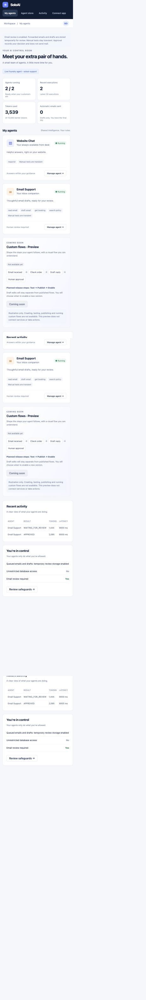

# Connect a Gmail inbox

This guide is for the person running SoloAI. To use a configured instance, start with [Getting started](GETTING-STARTED.md) and open **Integrations** in the app.


Gmail intake is read-only. SoloAI reads new inbox messages, forwards them to the
existing email queue, and produces drafts for operator review. It does not create
Gmail drafts, send mail, change labels, or delete messages. Forwarded content is
processed by the configured Azure Foundry agent and follows email-review retention.

1. Enable Gmail API in your Google Cloud project.
2. Configure the OAuth consent screen in testing mode and add your Gmail account
   as a test user. Request only `https://www.googleapis.com/auth/gmail.readonly`.
3. Create a **Web application** client. Register
   `http://127.0.0.1:8300/api/integrations/gmail/callback` for this local demo.
4. Keep the downloaded JSON outside the repository. Configure `GMAIL_CLIENT_FILE`.
5. Generate an encryption key once with
   `python -m scripts.gmail_key /absolute/private/path/gmail-token.key`, then set
   `GMAIL_TOKEN_KEY_FILE` to that file for both API and worker. Do not replace the
   key while encrypted connections exist. Use your secret manager in production.
6. Run `python -m scripts.email_admin migrate` to apply additive migration 002.
   Restart the API and email worker with the same configuration.
7. Sign in to SoloAI, open **Connect Gmail**, enter your Gmail address, and complete
   Google's consent flow. Google sign-in and consent are performed by the account owner.

The baseline history cursor is captured at connection time. Existing mail is not
imported. Send a new support message from a different account and check **Email
review** after approximately one minute. The worker handles one page per sync and
may take longer under load. Messages must be in INBOX, not Sent, Draft, Spam or Trash.
Attachments are not fetched. Unsupported bodies and messages longer than the current
8,000-character event limit are skipped with an audit event, rather than silently
truncating customer information.

Refresh tokens are encrypted with a server-held Fernet key and bound to their tenant
inside the encrypted payload. Access tokens live only in process memory. OAuth uses
PKCE, a one-time state, a short-lived browser-binding cookie, and validation of the
original SoloAI session. The Google mailbox must match the address entered before
connecting. A mailbox can belong to only one workspace. Secrets, codes, message
content and token responses are not logged. Keep HTTP access logs disabled for the
OAuth callback, including at any reverse proxy, since its query contains a code.

Message IDs produce stable tenant-scoped event IDs. The history cursor advances only
after a page has been enqueued successfully. Quota/rate-limit failures preserve the
cursor, and retries deduplicate existing jobs. A polling lease fences concurrent
workers. Disconnect invalidates the lease and removes saved tokens; it prevents new
intake but does not remove already queued drafts. To also revoke Google's grant,
remove SoloAI under your Google Account's third-party access settings.

If Google expires the history cursor, sync pauses with `gmail_history_expired`.
Disconnect and reconnect establishes a new baseline; it does not silently import an
old inbox. Revoked/expired authorization requires reconnection. Google testing-mode
authorizations can expire; a public launch also needs the applicable Google scope
verification and data-policy review. This local integration is not evidence of that
verification having been completed.

See Google's [web OAuth documentation](https://developers.google.com/identity/protocols/oauth2/web-server)
and [Gmail synchronization guide](https://developers.google.com/workspace/gmail/api/guides/sync).

## Local environment example

First follow [queued email setup](EMAIL-WORKFLOWS.md) to configure Foundry, enable Email Support and start the queue database. Use the same environment in API and worker terminals:

```sh
export PUBLIC_ORIGIN=http://127.0.0.1:8300
export SOLOAI_EMAIL_WORKFLOWS=true
export GMAIL_CLIENT_FILE=/absolute/private/path/google-web-client.json
export GMAIL_TOKEN_KEY_FILE=/absolute/private/path/gmail-token.key
# Generate once, never overwrite an existing connection's key:
python -m scripts.gmail_key "$GMAIL_TOKEN_KEY_FILE"
python -m scripts.email_admin migrate
# API terminal:
SOLOAI_METRICS_PORT=9470 uvicorn app.main:app --host 127.0.0.1 --port 8300 --workers 1 --no-access-log --no-proxy-headers
# Separate worker terminal with the same environment:
SOLOAI_METRICS_PORT=9471 python -m app.email_worker
```

Do not use an API key or Gmail password instead of OAuth. The Google project owner and the Gmail mailbox owner can be different accounts. Enable Gmail API in the OAuth client's project, then authorize with the mailbox account. A downloaded client JSON does not by itself enable Gmail API.

## Request flow



SQLite is for local development. Production email workflows require PostgreSQL; the default Azure SQL Terraform profile is not compatible with this opt-in workflow without infrastructure changes. There is no automatic email sending, live booking modification, attachment processing, old-inbox backfill or automatic retraining.

## Screenshots from the local setup

Connected read-only mailbox and last sync:



Email queue with human review:



Agent dashboard with usage and execution status:



These are local demo screenshots. They do not show OAuth secrets or customer email bodies. The connected test mailbox is shown intentionally. A successful connection confirms OAuth setup; verify new-message processing separately.

## Troubleshooting and launch requirements

Use the [Gmail runbook](runbooks/GMAIL.md) for OAuth errors, missing permissions, expired requests and inbox sync. Use the [local demo runbook](runbooks/LOCAL-DEMO.md) for ports, login, Foundry and Grafana.

Before public launch, complete applicable Google verification for restricted Gmail scopes, review data-use requirements, use HTTPS callbacks, manage secrets outside the image, and restrict database access. Testing mode is not a production identity or token-lifetime guarantee. See [Google scope guidance](https://developers.google.com/workspace/gmail/api/auth/scopes).
