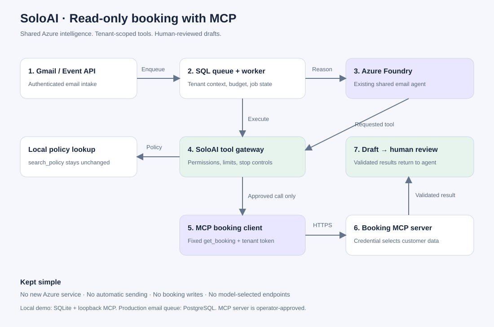
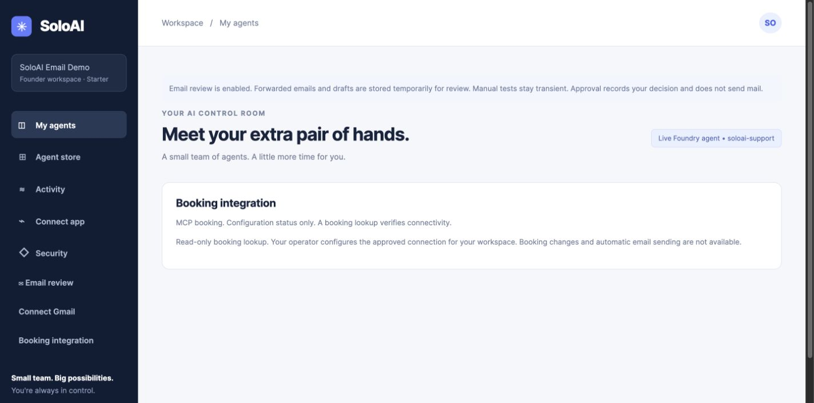
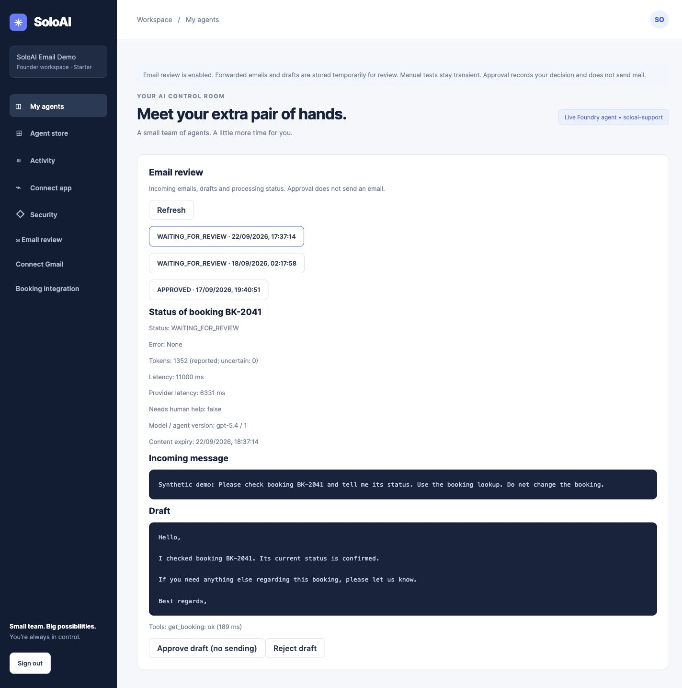

# Read-only booking integration with MCP

SoloAI can use one curated MCP booking tool in its queued email agent. The founder sees **Booking integration** in the dashboard. An operator configures the connection; the model cannot enter a server URL, select a tenant, or install tools.

This first release supports Streamable HTTP and the fixed `get_booking` contract. It uses the official Python MCP SDK, pinned to the supported 1.x line. Gmail continues to use its existing OAuth connector. Policy lookup stays local. No new Azure service is required.



## What happens to an email

1. Gmail polling or the authenticated event API places a new email in the SQL queue.
2. The worker loads the authenticated tenant's configuration and token allowance.
3. Azure Foundry selects from SoloAI's existing approved tools.
4. The tool gateway validates arguments, permissions, stop state and limits.
5. For a configured workspace, the MCP client calls only `get_booking`, using that workspace's credential.
6. The MCP server derives customer access from the credential and returns a small booking record. SoloAI validates it before giving it to Foundry.
7. The draft is saved for human review. Approval does not send mail or change a booking.

With no tenant entry, booking lookup uses the existing local support snapshot. A configured MCP failure fails the lookup; it never silently falls back to potentially stale local data. The connection is used by queued email jobs, not the synchronous manual draft endpoint.

## Run a local demonstration

Install `requirements.txt` in your existing virtual environment. Follow [email setup](EMAIL-WORKFLOWS.md) first. Use the same DATABASE_URL and workspace as your demo. The following helper creates synthetic booking BK-2041, not a live vendor connection:

```sh
export SOLOAI_ENV=development
export DATABASE_URL=sqlite:///./soloai-email-demo.db
python -m scripts.configure_mcp_demo \
  --workspace-email demo@soloai.local \
  --directory /tmp/soloai-booking-demo
export SOLOAI_MCP_CONFIG_FILE=/tmp/soloai-booking-demo/client.json
export BOOKING_MCP_SERVER_FILE=/tmp/soloai-booking-demo/server.json
python -m uvicorn examples.booking_mcp_server:app \
  --host 127.0.0.1 --port 8400 --no-access-log
```

In separate API and worker terminals, export SOLOAI_MCP_CONFIG_FILE alongside the existing Gmail, database and Foundry settings, then restart both processes. The helper refuses to overwrite files; reuse existing files on later runs. These temporary credentials are for local development only.

Open **Booking integration**. It should say **MCP booking**. This confirms configuration, not connectivity. Send a new synthetic email to the connected inbox asking about BK-2041. In **Email review**, verify `get_booking` succeeded and the draft awaits review. Do not send real customer data to the demo server.

## Configure a real booking service

An operator supplies a JSON file outside Git, readable only by the runtime identity:

```json
{
  "allowed_urls": ["https://booking.example.com/mcp"],
  "tenants": {
    "SOLOAI_WORKSPACE_ID": {
      "url": "https://booking.example.com/mcp",
      "token": "REPLACE_WITH_A_UNIQUE_TENANT_SCOPED_CREDENTIAL"
    }
  }
}
```

Use the internal workspace ID from the application database, not an ID in an email or model output. Credentials must be unique per workspace and map to that customer's records at the remote server. The file is an operator-owned secret, not an end-user upload. Mount it through your secret-management process. API and worker need the same configuration. Updates are read on subsequent lookups.

Production URLs must use HTTPS, with no embedded credentials, query or fragment, and must exactly match allowed_urls. HTTP is accepted only for 127.0.0.1 in development. Redirects are disabled and environment proxies are not inherited. The allowlist assumes a trusted operator: enforce network egress restrictions to block metadata endpoints and unintended private networks. It is not a DNS-rebinding defense.

The server must implement this exact tool contract:

- Name: `get_booking`
- Input: `{"booking_id":"BK-2041"}`
- Structured output: `{"found":true,"booking_id":"BK-2041","status":"confirmed","change_allowed":true}`
- Missing result: `{"found":false,"booking_id":"BK-2041","status":null,"change_allowed":null}`

Single JSON text results are also accepted. Extra output fields, mismatched references, tool errors and malformed data are rejected. No remote prompts, resources, tool descriptions or additional tools are imported into the agent. No Foundry agent redeployment is needed because its existing tool schema stays unchanged.

This release supports operator-provisioned bearer credentials. It does not implement generic MCP OAuth discovery, token refresh, arbitrary server onboarding or a marketplace. An OAuth-only vendor needs a reviewed adapter or future credential support. The included server is a loopback demonstration, not a production identity service.

## Security and reliability boundaries

- Tenant identity comes from SoloAI's execution context. The remote server must enforce credential-to-tenant authorization independently.
- New clients are created per tool call; MCP sessions and credentials are not pooled across tenants.
- Existing tool limits, stop controls and audit records remain in effect. MCP has a four-second total deadline within the gateway's five-second limit, and a 64 KiB wire-response cap. Returned status is capped at 100 characters.
- Tool output is untrusted data. Schema validation limits its shape but does not eliminate prompt injection or prove its truth.
- Booking reference possession is not customer identity verification. Reviewers must check identity before disclosing booking details.
- Credentials, customer bodies and remote error text are not added to logs or metric labels. Existing tool count and latency metrics cover MCP-backed get_booking calls, but do not distinguish transport type.
- This is read-only. No email sending, booking mutation, arbitrary SQL or automatic retraining.
- SQLite remains local-only. Production email workflows still require PostgreSQL; the default Azure SQL Terraform profile is not changed by MCP.

## Screens and troubleshooting

The architecture image shows the implemented optional path. Runtime screenshots show a synthetic local setup, not an Azure deployment or third-party booking vendor certification.

See the [MCP runbook](runbooks/MCP.md), [Gmail setup](GMAIL.md), and [email workflow](EMAIL-WORKFLOWS.md).

Protocol reference: [official MCP Python SDK](https://github.com/modelcontextprotocol/python-sdk/tree/v1.x).

Configured connection in SoloAI:



Live synthetic verification on 22 September 2026: Foundry gpt-5.4 invoked get_booking through the local MCP server, the tool completed in 189 ms, and the email reached WAITING_FOR_REVIEW using 1,352 reported tokens. This is a single acceptance run, not a latency benchmark.



[Download the architecture screenshot](screenshots/mcp-architecture.png) or use the editable SVG above.
