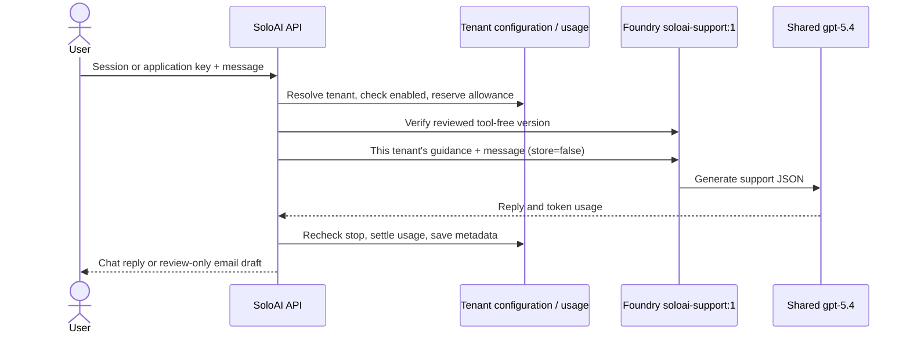

# Run SoloAI with the live Foundry agent

The local dashboard supports real Website Chat replies and Email Support drafts using
`soloai-support:1` on `gpt-5.4`. Both the dashboard and SDK `/api/events` path use
this adapter. Gmail/Outlook ingestion and automatic email sending are not implemented.

## Start

Install `requirements.txt` in your virtual environment, authenticate with `az login`,
and run from the repository root:

```sh
export AZURE_FOUNDRY_PROJECT_ENDPOINT=https://soloai-v0-resource.services.ai.azure.com/api/projects/soloai-v0
export AZURE_FOUNDRY_AGENT_NAME=soloai-support
export AZURE_FOUNDRY_AGENT_VERSION=1
export AZURE_FOUNDRY_MODEL=gpt-5.4
uvicorn app.main:app --host 127.0.0.1 --port 8000 --no-access-log --no-proxy-headers
```

If Azure CLI uses a custom configuration directory, retain its `AZURE_CONFIG_DIR`
and keep `az` on PATH. Credentials stay on the server; no Azure key enters the browser.
The application does not load `.env` automatically: export variables before starting.

Open http://127.0.0.1:8000, sign in, choose **My agents → Manage agent**, supply
business guidance, and **Turn on agent**. Test a question or create an email draft.
The live banner distinguishes actual Foundry calls from the offline demo. Activity
shows execution status, latency and usage. Security contains the emergency stop.

## Request and isolation



No shared conversation or previous response ID is used. The shared agent definition
contains no tenant-specific business content. Each invocation supplies only the
authenticated workspace's saved guidance. Response JSON is validated; agent tool
changes or instruction drift fail closed. Model instructions are not the tenant
security boundary: authentication and SQL scoping are enforced by the application.

Requests run off the event loop while Azure responds, allowing other users and Stop
requests to proceed. Each workspace retains its atomic 10,000-token starter allowance
and 20 requests/minute limit. Reservations include serialized input, reviewed
instructions, output ceiling and overhead. Uncertain failures keep the reservation;
there are no automatic paid retries. An in-flight model call may still bill after Stop,
but its reply is suppressed. This is request/response chat, without streaming.

SoloAI persists configuration and execution metadata, not request or reply content.
`store=false` does not override Azure's service-level retention or abuse monitoring.

## Deployment boundary

This local connection does not deploy the production platform. Existing Terraform
provisions a private direct-model backend; it does not provision this Foundry Agent
Service project or its private networking. Before deploying this mode, configure
project network access from Container Apps and grant its managed identity only the
required read/invoke project permissions. Do not put developer CLI credentials into
a container. Azure SQL and the documented production hardening remain required.

API reference: [Foundry Responses](https://ai.azure.com/api-reference/responses/create-response/).

## Verified on 10 September 2026

The signed-in dashboard completed two live tests against version 1:

| Flow | Result | Tokens |
| --- | --- | ---: |
| Website Chat | Explained SoloAI capabilities and 10,000 starter tokens from saved guidance | 614 |
| Email Support | Draft referred a password reset to human support, without claiming an action | 633 |

Ten automated tests pass, including tenant boundaries, atomic quotas, strict response
validation, version pinning, and suppressing an in-flight reply after emergency stop.
