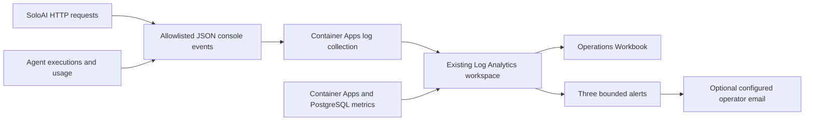

# SoloAI operations monitoring

The MVP uses Azure Monitor and its existing Log Analytics workspace. No Prometheus,
Grafana server, Application Insights SDK, or public metrics endpoint is added.
The Terraform Workbook resource's name includes `application_insights`; it does not
create an Application Insights component.

## What is included

- Infrastructure metrics exported from Container Apps and PostgreSQL into AzureMetrics.
- HTTP requests/second, P50/P95/P99 latency, 5xx errors and 429 rejections by route template.
- Agent executions, failures, end-to-end P95 and provider-adapter P95 latency.
- Reported total tokens/minute, separately labelled uncertain reservations, and maximum
  observed workspace allowance percentage. Allowance values are execution snapshots,
  not a census of inactive workspaces. No tenant identifier is logged.
- A rolling 30-day 99% execution-success SLO, allowed failures, remaining error budget
  and burn rate. Negative remaining budget means the target was exceeded.

Provider-adapter time includes authentication and agent-definition checks, not just
model generation. Input/output token splits, model deployment quota utilization and
provider-specific throttling classification are not yet instrumented. Total reported
tokens and tenant allowance utilization are available now.

## SLO definition and limits

Eligible events are completed or failed live agent executions. User stops, demo runs
and requests rejected before execution are excluded. HTTP failures and quota rejections
remain visible separately. Zero eligible events yields no success percentage.
This is an execution SLO, not an external availability SLA: process crashes before a
final event, logging outages and requests that never reach SoloAI are not captured.
At low volume, percentile and error-budget figures are noisy. Add an external synthetic
availability probe before making an uptime commitment.

## Alerts

Three five-minute alerts: more than five agent failures; HTTP 5xx above 5% with at
least 20 requests; agent P95 above 30 seconds with at least 20 executions. Set the
existing `alert_email` Terraform variable to an operator-approved recipient to enable
email delivery. With no recipient, alert records still exist but email is not sent.
Burn rate is displayed, not separately paged on in this first version.

## Deploy and view

Follow [Terraform deployment](../infra/terraform/README.md), reviewing the plan before
applying it. Build/deploy the updated application image too; Terraform alone cannot
instrument an old image. Open **Azure Monitor → Workbooks → SoloAI operations**.
The `operations_workbook_id` output identifies the dashboard. Logs and AzureMetrics
may take several minutes to arrive; queries can report missing tables before first
traffic or metric export. KQL files are separated under `infra/terraform/queries`.
Workbook panels use the last hour; the SLO panel uses 30 days.

Azure RBAC controls access; restrict workspace and Workbook access to operators.
Console event fields are allowlisted and exclude bodies, replies, raw URLs, query
strings, customer identifiers and credentials. Disable access logs as shown in the
Docker command. Avoid enabling provider debug/HTTP logging. This does not sanitize
other libraries' logs automatically.

The existing 30-day retention remains. Per-request logs and metric exports incur
Azure ingestion/query and alert charges; monitor volume before increasing traffic.
No sampling is applied to these events because counts and the SLO need completeness.

## Workflow

Validated locally with application tests and mocked Terraform plans. Azure resources,
KQL execution, metric-export availability and actual notification delivery have not
been live-deployed or verified by this change.
