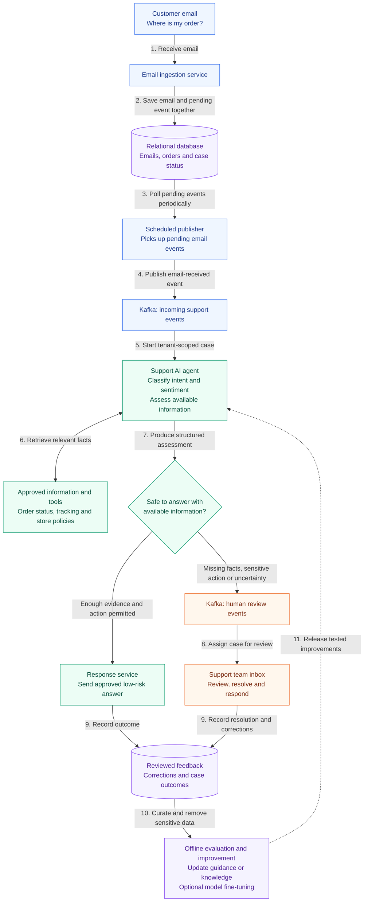

# Ecommerce email triage and human review

**Status: proposed use case.** The current SoloAI MVP does not implement inbox
ingestion, Kafka processing, automated sending or model retraining. This document
describes a possible extension, not a deployed architecture.

## Business scenario

An online store receives emails about late deliveries, returns, refunds and damaged
products. SoloAI checks each message against order information and store policies,
classifies intent and sentiment, and determines whether it can safely answer or
needs a support team member to review the case.

## High-level flow

The scheduled publisher can run at an operator-selected interval, for example every
minute. It reads pending events from an outbox table rather than repeatedly sending
all emails. Kafka holds events; support staff work in an authenticated case dashboard.
The agent and response service also update case status and execution metadata in the
database. Those bookkeeping paths are omitted from the diagram for readability.

## Example: a delayed delivery

A customer writes: “My order was supposed to arrive yesterday. Where is it?”

The agent identifies delivery status as the intent and negative sentiment. It looks
up the order using an authorized customer-to-order association, not an arbitrary
order number supplied in the email.

| Evidence and permissions | Decision |
|---|---|
| Carrier confirms delivery tomorrow and policy permits a status response | Send a factual tracking update if automatic sending is enabled |
| Tracking is missing or conflicting | Publish a human-review event with the missing information identified |
| Customer requests compensation that requires approval | Draft a response and route the case for approval |
| Automatic sending is disabled | Present the draft for review even when the answer is supported |

Negative sentiment can increase priority. It should not alone determine whether a
case needs a human. The assessment should include intent, sentiment, evidence
references, a proposed response and an escalation reason. Application policy checks
permissions and evidence requirements before any response is sent.

## Events and reliable processing

Save the email and pending event in one database transaction using an outbox table.
After Kafka acknowledges publication, mark that outbox entry as published. A crash
between those operations can cause duplicate delivery, so consumers must deduplicate
by event ID. Use bounded retries and a failed-event queue with operator alerts.

A human-review event should contain an event ID, case ID, tenant ID, classification,
escalation reason and a restricted reference to the draft. Keep full emails and
personal information out of Kafka where possible. Authenticate the producer and
enforce tenant ownership when retrieving case data; a tenant ID in a payload is not
authorization by itself.

Before sending, recheck permissions, approval, case status and agent stop state.
Use a stable send-operation ID and provider idempotency where available. If a send
times out with an unknown outcome, reconcile with the email provider before retrying
to avoid duplicate customer replies. Track publisher lag, processing failures,
escalation rate, latency and token usage.

## Controlled response improvement

Emails do not automatically retrain the model or change its parameters. Retaining
business content for this workflow must be explicitly enabled with access controls,
a retention period and deletion handling. Training use needs separate authorization.

1. Collect case outcomes and human corrections. An automatically sent reply is not
   automatically a correct training example.
2. Select reviewed examples and remove personal information, credentials and other
   sensitive content. Keep tenant data separated.
3. Run offline evaluations for factual accuracy, escalation decisions, permission
   adherence and resistance to instructions embedded in emails.
4. Improve store knowledge, instructions or application decision thresholds first.
   Consider fine-tuning only if it is supported by the chosen model and evaluation
   results justify it. Fine-tuning changes model weights; ordinary requests do not.
5. Test each version on held-out cases, approve the release and keep a rollback version.

Customer email remains untrusted input throughout. It cannot override store policies,
change the agent's permissions or authorize refunds. This workflow should begin with
read and draft permissions, then add narrowly scoped sending after review controls
and failure handling have been verified.

See the [current architecture](../docs/ARCHITECTURE.md) for the implemented deployment
target. Kafka, ingestion workers and the case-review workflow would require separate
implementation and cost evaluation.
